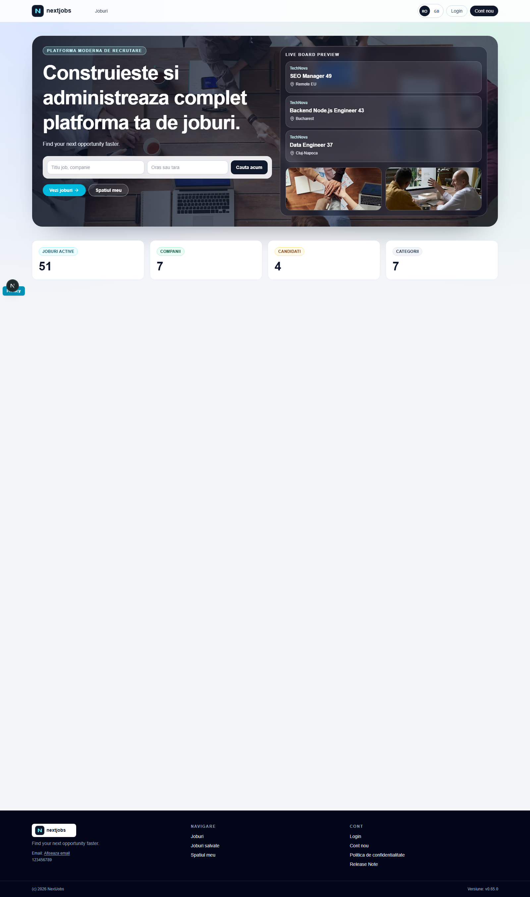
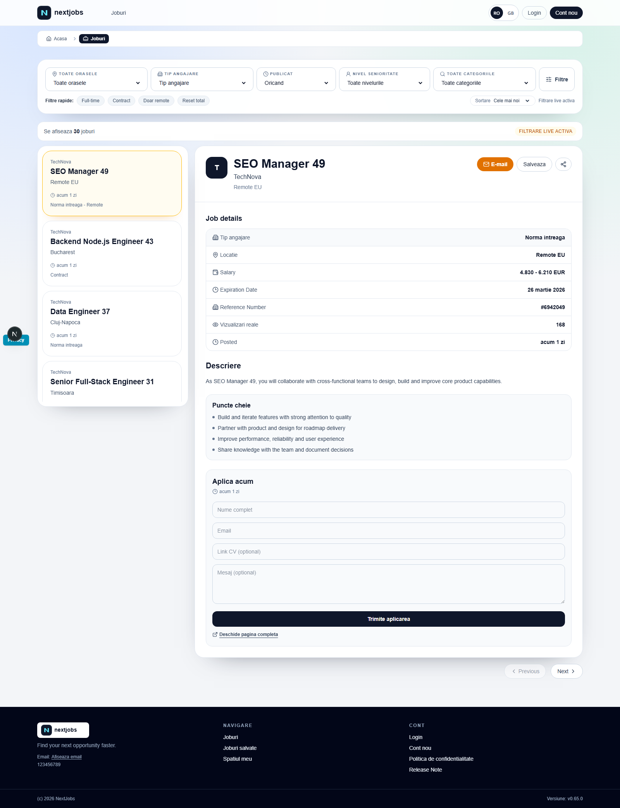
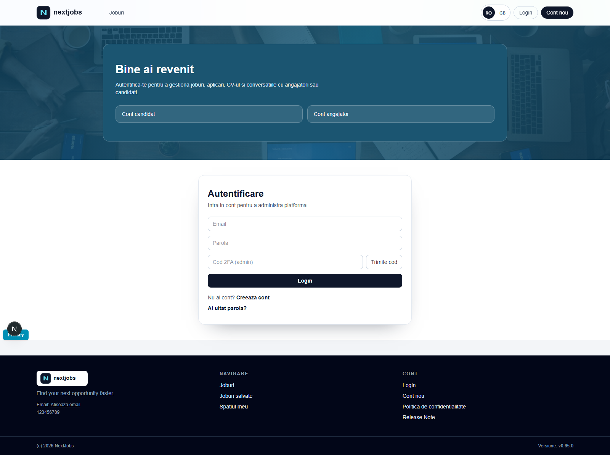
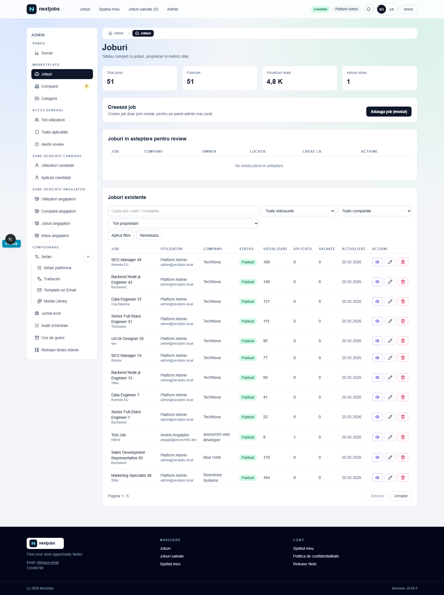
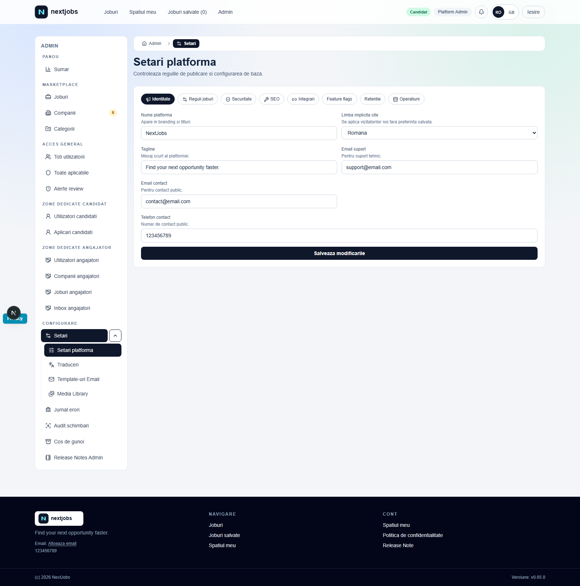

# NextJobs
[](https://github.com/aandrei93/Next.Jobs/actions/workflows/ci.yml)
[](https://github.com/aandrei93/Next.Jobs/actions/workflows/e2e-smoke.yml)
[](https://github.com/aandrei93/Next.Jobs/actions/workflows/coverage.yml)
[](https://github.com/aandrei93/Next.Jobs/actions/workflows/codeql.yml)
[](https://github.com/aandrei93/Next.Jobs/actions/workflows/preview.yml)
[](https://github.com/aandrei93/Next.Jobs/actions/workflows/release.yml)
[](https://github.com/aandrei93/Next.Jobs/security/dependabot)

Full-stack job platform built with `Next.js 16`, `Prisma`, `NextAuth`, `SQLite` (default), role-based workspace, and full admin panel.

## Project Status
This repository is actively developed and already includes:
- Public jobs marketplace (`/`, `/jobs`, `/jobs/[slug]`)
- Candidate and employer workspaces (role-aware `/me/*` routes)
- Full admin backoffice (`/admin/*`)
- Runtime settings from admin (maintenance, limits, email, locale, media, etc.)
- Public and admin release notes pages
- Error monitoring page in admin (`/admin/errors`)
- Housekeeping and digest automation scripts
- Global scroll-reveal animations with hydration-safe behavior

## Screenshots
### Public Interface



### Admin Interface




## Tech Stack
- `next` `16.1.6`
- `react` `19.2.3`
- `next-auth` `4.24.13`
- `prisma` / `@prisma/client` `6.16.2`
- `sqlite` by default (`prisma/dev.db`)
- `tailwindcss` `4`
- `typescript` `5`

## Architecture Overview

### App zones
- Public: browse/search jobs, view details, apply, save jobs, release notes.
- Auth: login/register/forgot/reset/verify.
- Workspace:
  - Candidate: profile, CV builder, own applications.
  - Employer: profile, company management, posted jobs, incoming applications.
- Admin: jobs moderation, companies, categories, users/roles, applications, settings, error logs, admin release notes.

### Data model highlights
- `User` with `role` (`ADMIN`, `CANDIDATE`, `EMPLOYER`) and `accountType` (`candidate`, `employer`).
- `Job` with moderation lifecycle: `DRAFT`, `PENDING_REVIEW`, `PUBLISHED`, `CLOSED`.
- `Application` with pipeline status: `NEW`, `SCREENING`, `INTERVIEW`, `OFFER`, `REVIEWED`, `REJECTED`, `HIRED`.
- `JobUniqueView` for unique view counting (no +1 on refresh for same visitor/user).
- `ErrorLog` for runtime and workflow diagnostics.
- `SiteSettings`, `EmailTemplate`, `LocaleTranslation`, `MediaAsset` for admin-driven runtime behavior.

## Main Features (Current)

### Public / Jobs
- Advanced filters, sorting, search, infinite list behavior in jobs master-detail UI.
- No full refresh needed to switch selected job details.
- Unique job views tracking.
- Apply flow:
  - Visitor: fullName, email, CV link, message.
  - Candidate logged in: identity locked from account, choose profile CV snapshot or file upload.
  - Duplicate apply protection for logged-in candidate (hard guard in backend).
- Existing application status visible directly in jobs UI.

### Candidate workspace
- Profile, CV builder, security section.
- Applications inbox with conversation thread.

### Employer workspace
- Company onboarding and management.
- Job posting and pipeline management.
- Incoming applications and messaging.

### Admin panel
- Dashboard analytics.
- Jobs moderation (approve/reject from pending review).
- Company verification/suspension.
- User role management.
- Central settings with runtime effect.
- Error logs page with "clear all logs" action.

### Localization
- RO/EN locale system with admin-manageable translation overrides.

## Prerequisites
- Node.js `22.x` LTS recommended (`20+` minimum)
- npm `10+`
- No PHP runtime required
- For production: reverse proxy + TLS recommended
- Pure static shared hosting (`public_html` only, no Node runtime) is not supported for this app

## Local Setup

1. Install dependencies
```bash
npm install
```

2. Create `.env` (see Environment Variables section below)

3. Generate Prisma client and run migrations
```bash
npm run prisma:generate
npx prisma migrate deploy
```

For local development you can also use:
```bash
npm run prisma:migrate
```

4. Seed database
```bash
npm run db:seed
```

5. Run app
```bash
npm run dev
```

## Build and Validation
```bash
npm run lint
npm run build
npm run start
```

## Environment Variables

### Required
- `DATABASE_URL` (default sqlite path is acceptable)
- `NEXTAUTH_SECRET` (or `AUTH_SECRET`)
- `NEXT_PUBLIC_APP_URL` (used in metadata, links, emails, jobs upload URL normalization)
- `HOUSEKEEPING_SECRET` (used by internal housekeeping/digest endpoints)

### Optional but recommended
- `ADMIN_EMAIL` (seed admin)
- `ADMIN_PASSWORD` (seed admin)
- SMTP variables (if not using admin settings values):
  - `SMTP_HOST`
  - `SMTP_PORT`
  - `SMTP_USER`
  - `SMTP_PASSWORD`
  - `SMTP_FROM`

### Notes
- `NEXTAUTH_URL` can still be set explicitly in production setups for auth callbacks.
- Many operational settings are persisted in `SiteSettings` and editable from admin UI.

## NPM Scripts
- `npm run dev` - dev server
- `npm run build` - production build
- `npm run start` - run built app
- `npm run lint` - lint
- `npm run typecheck` - TypeScript type check without emit
- `npm run prisma:generate` - regenerate Prisma client
- `npm run prisma:validate` - validate Prisma schema
- `npm run prisma:migrate:status` - show migration status for current DB
- `npm run prisma:migrate` - Prisma migrate dev
- `npm run prisma:studio` - Prisma Studio
- `npm run db:seed` - seed DB
- `npm run resume:migrate-canonical` - one-off resume migration helper
- `npm run housekeeping:run` - run housekeeping endpoint caller
- `npm run housekeeping:setup-task` - register Windows scheduled task
- `npm run digest:run` - run digest endpoint caller
- `npm run digest:setup-task` - register Windows scheduled task
- `npm run backup:run` - local SQLite + uploads backup snapshot
- `npm run restore:run -- -DbBackupPath <path>` - restore SQLite backup (optionally uploads archive)
- `npm run test:unit` - run unit tests with Vitest
- `npm run test:unit:watch` - run unit tests in watch mode
- `npm run test:coverage` - run unit tests with coverage output (`coverage/`)
- `npm run test:e2e` - Playwright smoke E2E tests
- `npm run release:bump -- [vX.Y.Z|auto] "Title RO" "Title EN" "Item RO 1|Item RO 2" "Item EN 1|Item EN 2"` - prepend frontend/admin release entries (auto patch bump supported)
- `npm run release:quick -- "Title RO" "Title EN"` - fast changelog entry using automatic patch version bump

## CI and Testing
- GitHub Actions workflows:
  - `.github/workflows/ci.yml`
  - `.github/workflows/e2e-smoke.yml`
  - `.github/workflows/coverage.yml`
  - `.github/workflows/codeql.yml`
  - `.github/workflows/preview.yml`
  - `.github/workflows/release.yml`
  - `.github/workflows/dependabot-automerge.yml`
- Core validation workflows run on push/PR for `master` and `main`
- Main pipeline steps: `npm ci` -> `prisma:generate` -> `prisma:validate` -> `migrate deploy` -> `prisma:migrate:status` -> `lint` -> `typecheck` -> `test:unit` -> `build`
- `E2E Smoke` workflow runs Playwright smoke tests (including admin login flow)
- `Coverage` workflow runs Vitest with coverage and uploads `coverage/` artifact
- `CodeQL` workflow performs security/code scanning for JS/TS
- `Preview Deploy` workflow deploys PR preview when `VERCEL_TOKEN`, `VERCEL_ORG_ID`, `VERCEL_PROJECT_ID` are configured in repo secrets
- `Release` workflow auto-creates GitHub releases for pushed `v*` tags
- Dependabot is configured via `.github/dependabot.yml` (npm + GitHub Actions), with patch auto-merge workflow for Dependabot PRs

## Automation (Housekeeping + Digest)

### Windows Task Scheduler
```powershell
npm run housekeeping:setup-task
npm run digest:setup-task
```

### Manual run
```powershell
npm run housekeeping:run
npm run digest:run
```

Both scripts read `.env` automatically and require `HOUSEKEEPING_SECRET`.

## Backup and Restore (SQLite)

Create backup:
```powershell
npm run backup:run
```

This creates artifacts in `backups/`:
- `dev-YYYYMMDD-HHMMSS.db`
- `uploads-YYYYMMDD-HHMMSS.zip` (if uploads exist)

Restore database:
```powershell
npm run restore:run -- -DbBackupPath \"E:\\path\\to\\dev-YYYYMMDD-HHMMSS.db\"
```

Restore database and uploads:
```powershell
npm run restore:run -- -DbBackupPath \"E:\\path\\to\\dev-YYYYMMDD-HHMMSS.db\" -UploadsArchivePath \"E:\\path\\to\\uploads-YYYYMMDD-HHMMSS.zip\"
```

## E2E Tests (Playwright)

Install browser binaries once:
```bash
npx playwright install
```

Run smoke suite:
```bash
npm run test:e2e
```

By default tests use `http://127.0.0.1:3000`. Override with:
```bash
E2E_BASE_URL=https://your-domain npm run test:e2e
```

## Production Deployment Guide

1. Provision VM/container (Linux or Windows) with Node.js 22.
2. Pull repository.
3. Configure `.env`.
4. Install dependencies: `npm install`.
5. Apply migrations: `npx prisma migrate deploy`.
6. Seed once if needed: `npm run db:seed`.
7. Build: `npm run build`.
8. Run with process manager (PM2/systemd/NSSM).
9. Add reverse proxy + HTTPS.
10. Configure housekeeping/digest schedule.

## Role and Access Behavior
- `ADMIN` always reaches admin panel.
- `CANDIDATE` and `EMPLOYER` are routed to role-specific workspace sections.
- Updating role in admin also aligns `accountType` to keep workspace behavior consistent.
- Session refresh in auth callbacks syncs role/accountType from DB.

## Key Routes

### Public
- `/`
- `/jobs`
- `/jobs/[slug]`
- `/saved-jobs`
- `/privacy`
- `/changelog`

### Auth
- `/login`
- `/register`
- `/register/employee`
- `/register/employer`
- `/forgot-password`
- `/reset-password`
- `/verify-email`

### Workspace
- `/me` (auto role redirect)
- Candidate: `/me/candidate/*`
- Employer: `/me/employer/*`
- Access denied: `/me/access-denied`

### Admin
- `/admin`
- `/admin/jobs`
- `/admin/companies`
- `/admin/categories`
- `/admin/applications`
- `/admin/users`
- `/admin/settings`
- `/admin/settings/translations`
- `/admin/settings/media`
- `/admin/settings/email-templates`
- `/admin/errors`
- `/admin/release-notes`

## Troubleshooting

### "JWT_SESSION_ERROR decryption operation failed"
- Ensure a stable `NEXTAUTH_SECRET` / `AUTH_SECRET` value.
- If secret changed, existing cookies become invalid; sign out and sign in again.

### "HOUSEKEEPING_SECRET is missing"
- Set `HOUSEKEEPING_SECRET` in `.env`.
- Re-run `npm run housekeeping:run`.

### Apply blocked with no visible error
- Check `/admin/errors` for `source=apply` entries; reasons are logged.

### Uploaded CV links look broken
- Ensure `NEXT_PUBLIC_APP_URL` is valid (`https://your-domain`).

## Security and Operations Notes
- App-level rate limiting for login/register/apply.
- Maintenance mode can block public or all non-admin traffic based on settings.
- Error monitoring from client and server flow diagnostics.
- Admin two-factor support for admin login flow.
- Upload hardening validates MIME, extension, and file signature before write.
- Email sending uses retry policy and logs delivery failures in error logs.
- Security headers are enforced globally (including `X-Content-Type-Options`, `X-Frame-Options`, `Referrer-Policy`, and `Permissions-Policy`).
- Internal automation endpoints (`housekeeping`/`digest`) validate secrets using timing-safe comparison.
- Local runtime artifacts (`public/uploads`, `backups`, SQLite files) are ignored via `.gitignore`.

## Quick Project Audit Checklist
Run before each release:
```bash
npm run lint
npm run build
npx prisma validate
```
Then manually verify:
- Apply flow for visitor + candidate + employer guard
- Role switch candidate <-> employer from admin
- Admin moderation and email notifications
- `/admin/errors` log ingestion and clear action
